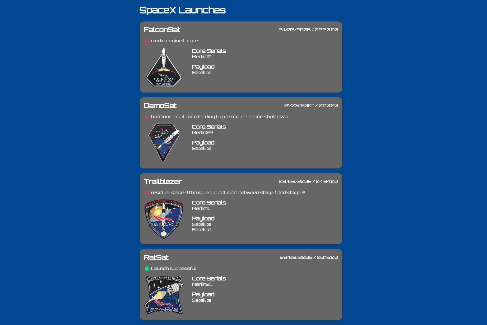

# Notes

- I wasn't sure what "top 10" means so the application shows the first 10 launches.
- I wasn't sure if the data needed to be loaded server side or on page load. This solution executes a request on page load to retrieve the data.
- There seems to be conflicts between prettier/eslint so formatting could do with addressing. Feels like out of scope for the excercise. This is causing the build to fail. The application can be run in dev mode using 'yarn dev'.
- When running the tests, there is a warning with 'renderHook' not supporting react version 18 yet. This can be ignored.

# Mobile

# Desktop

